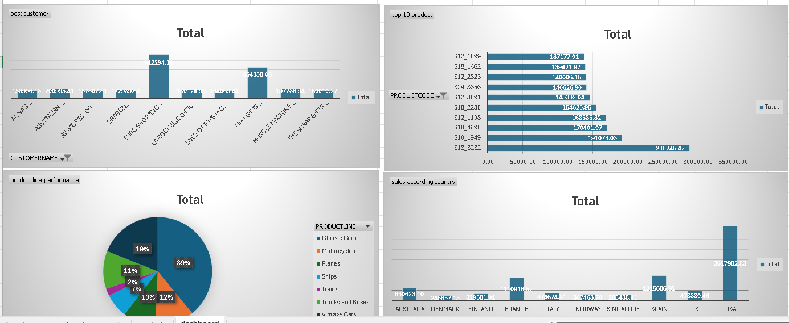

# Sales Performance Analysis — Excel

## Overview
Excel dashboard analyzing sales data with KPIs, trends, and regional performance breakdowns.

## Features
- Sales KPI summary (revenue, growth, targets)
- Monthly and regional trend analysis
- Interactive Excel dashboard with charts

## Files
| File | Description |
|------|-------------|
| `sales-project.xlsx` | Main Excel analysis file |
| `2026-04-22.png` | Dashboard preview screenshot |

## Tools Used
- Microsoft Excel

## Dashboard Preview

